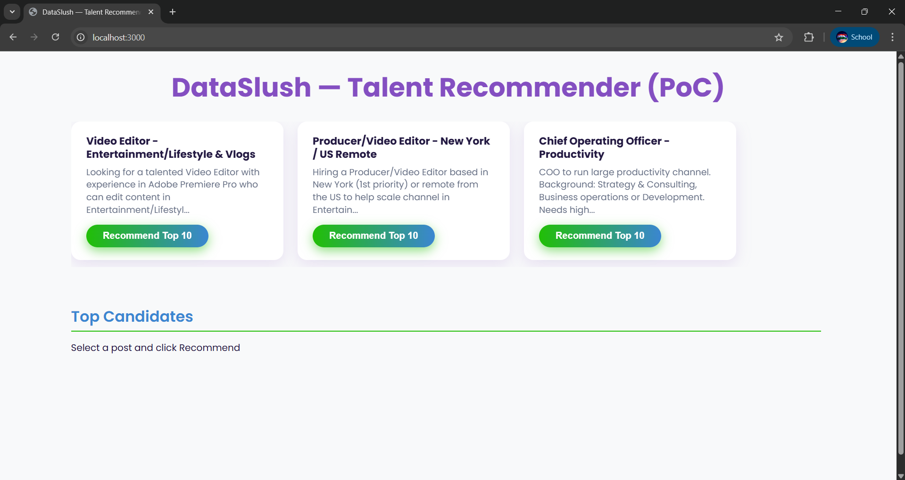

# DataSlush — Talent Recommender (PoC)

A **Proof-of-Concept Talent Recommender System** that matches job postings with top candidates based on skills, location, budget, and experience. Built with **FastAPI** backend and **React** frontend, it provides a modern, interactive interface to explore candidate recommendations.

---

## Table of Contents

* [Features](#features)
* [Tech Stack](#tech-stack)
* [Project Structure](#project-structure)
* [Setup & Installation](#setup--installation)

  * [Backend Setup](#backend-setup)
  * [Frontend Setup](#frontend-setup)
* [Usage](#usage)
* [Deployment](#deployment)
* [Troubleshooting](#troubleshooting)
* [Screenshots](#screenshots)


---

## Features

* Load and parse **job postings** and **candidate profiles**.
* Compute candidate ranking using:

  * Semantic similarity via **Sentence Transformers**
  * Skill overlap
  * Location match
  * Budget alignment
  * Soft skills and popularity scoring
* View **Top 10 recommended candidates** for each job posting.
* Modern and responsive **frontend UI** built with React and CSS.
* Lightweight backend with **FastAPI**, suitable for quick deployment.

---

## Tech Stack

**Backend:**

* Python (latest version)
* FastAPI
* Pandas, NumPy
* Scikit-learn
* Sentence Transformers
* Uvicorn

**Frontend:**

* React.js
* CSS (custom styling)
* JavaScript

---

## Project Structure

```
data-slush-recommender/
│
├─ backend/                     
│  ├─ app.py                  # FastAPI backend entrypoint
│  ├─ recommender.py          # Candidate ranking logic
│  ├─ utils.py                # Data loading & parsing
│  ├─ requirements.txt        # Python dependencies
│  └─ data/
│      └─ talent_profiles.csv  # Candidate dataset
│
├─ frontend/                    
│  ├─ src/
│  │   ├─ App.jsx             # Main React component
│  │   ├─ index.jsx           # React entrypoint
│  │   └─ components/
│  │       └─ CandidateList.jsx # Candidate list component
│  ├─ public/
│  │   └─ index.html          # HTML template
│  └─ package.json            # Node dependencies and scripts
```

---

## Setup & Installation

### Backend Setup

1. Open **PowerShell** (or terminal) and navigate to `backend` folder:

```bash
cd backend
```

2. Set execution policy (PowerShell only):

```powershell
Set-ExecutionPolicy -ExecutionPolicy RemoteSigned -Scope Process
```

3. Create and activate virtual environment:

```bash
python -m venv venv
.\venv\Scripts\activate      # Windows
source venv/bin/activate     # Mac/Linux
```

4. Install Python dependencies:

```bash
pip install -r requirements.txt
```

5. Start FastAPI server:

```bash
python app.py
```

> Backend server will run on: `http://127.0.0.1:8000`

---

### Frontend Setup

1. Open a new terminal and navigate to `frontend` folder:

```bash
cd frontend
```

2. Install Node dependencies:

```bash
npm install
```

3. Start React frontend:

```bash
npm start
```

> Frontend will open in browser: `http://localhost:3000`

---

## Usage

1. Open the frontend in your browser.
2. Select a job posting from the **Job Posts Panel**.
3. Click **Recommend Top 10**.
4. View recommended candidates in the **Top Candidates Panel** with details:

   * Name
   * Skills
   * Location
   * Match Score
   * Rates

---

## Deployment

### Local Deployment

* Backend: `python app.py`
* Frontend: `npm start`

### Production Deployment (Optional)

* **Backend:**

  * Use `uvicorn` with host and port for production:

    ```bash
    uvicorn app:app --host 0.0.0.0 --port 8000
    ```
  * Deploy on services like **AWS EC2**, **Heroku**, or **Docker**.

* **Frontend:**

  * Build production-ready files:

    ```bash
    npm run build
    ```
  * Deploy `build/` folder using **Netlify**, **Vercel**, or static web server.

* **Connect Frontend & Backend:**

  * Update `BASE_URL` in `App.jsx` to point to production backend URL.

---

## Troubleshooting

* **CORS errors**: Make sure backend allows frontend origin in FastAPI:

```python
app.add_middleware(
    CORSMiddleware,
    allow_origins=["*"],  
    allow_credentials=True,
    allow_methods=["*"],
    allow_headers=["*"],
)
```

* **React frontend not starting**:

  * Delete `node_modules` and `package-lock.json` and run `npm install` again.
* **Python modules not found**: Ensure virtual environment is active.

---

## Screenshots




